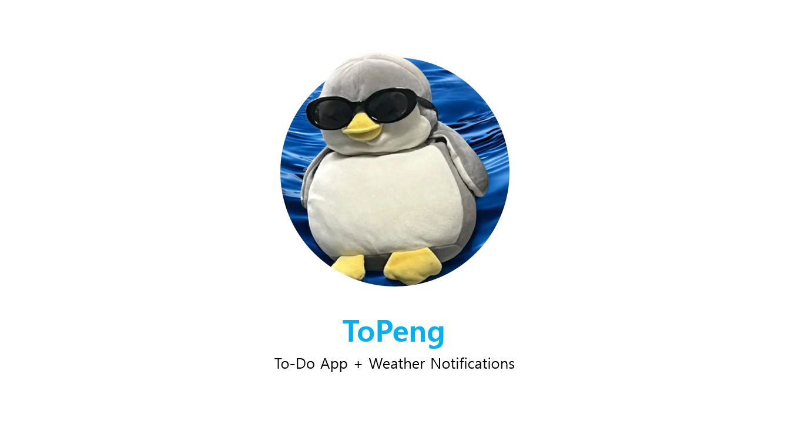
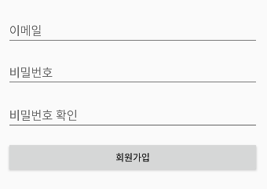
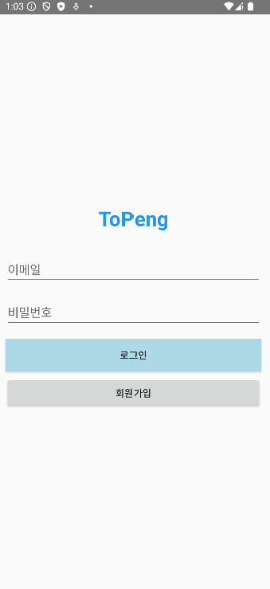
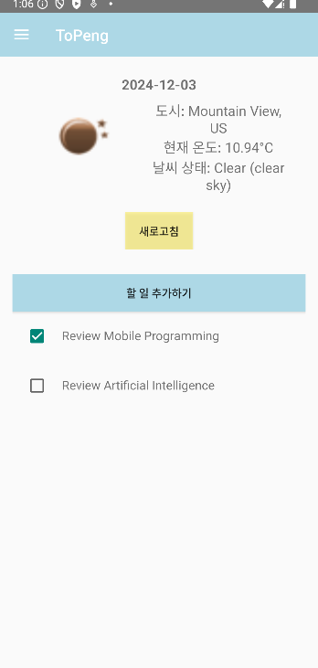
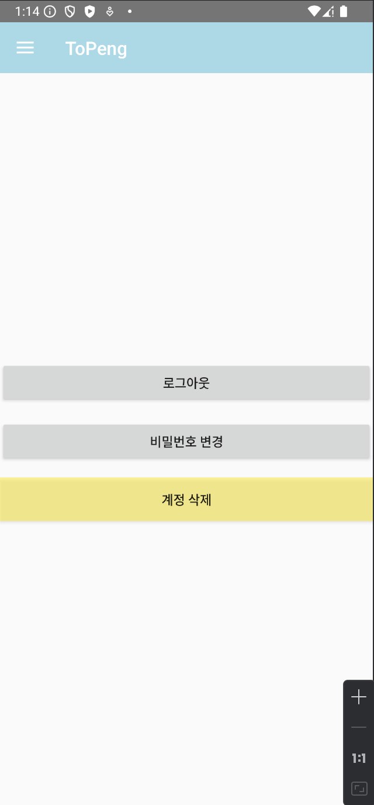
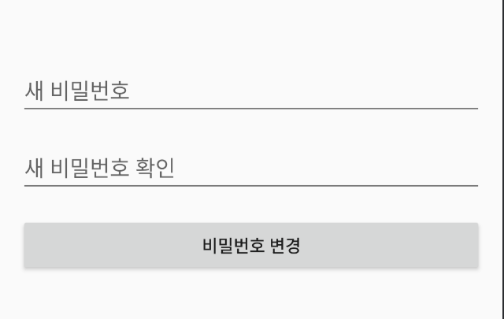

## ToPeng 🐧


## 프로젝트 소개
- 앱은 사용자가 로그인 후 위치 기반 날씨 정보와 투두 리스트를 함께 관리할 수 있는 앱입니다.
- 날씨 API를 통해 실시간 날씨를 제공하고, 투두 리스트를 통해 할 일을 쉽게 추가하고 관리할 수 있습니다.
- 위치 추적을 통해 사용자의 정확한 날씨 정보를 제공합니다.

## 1. 개발 환경
프론트엔드: Kotlin, Android Studio, XML
백엔드: OpenWeatherMap API (날씨 정보 제공), SQLite(todo저장)

## 2. 프로젝트 구조

```text
main
│
├── java/com/example/topeng
│   ├── ui/theme
│   ├── ChangePasswordActivity.kt
│   ├── LoginActivity.kt
│   ├── MainActivity.kt
│   ├── MyDatabaseHelper.kt
│   ├── MyPageActivity.kt
│   ├── RegisterActivity.kt
│   ├── ToDoAdapter.kt
│   ├── ToDoFragment.kt
│   ├── ToDoItem.kt
│   ├── WeatherApiService.kt
│   ├── WeatherFragment.kt
│   └── WeatherResponse.kt
│
└── res
    ├── AndroidManifest.xml
    ├── drawable
    ├── layout
    ├── values
    └── ...

test
│
└── java/com/example/topeng
    └── ExampleUnitTest.kt

.gitignore
build.gradle.kts
proguard-rules.pro
```

## 3. 기능소개

#### 1. 회원가입 화면
- 회원가입 화면에서는 **이메일**, **비밀번호**, **비밀번호 확인**을 입력받습니다.
- 사용자가 입력한 정보를 기반으로 회원가입을 진행할 수 있습니다.
- **비밀번호 확인** 필드는 사용자가 입력한 비밀번호가 일치하는지 확인합니다.
<br>

<br>

#### 2. 로그인 화면
- 로그인 화면에서는 **이메일**과 **비밀번호**를 입력받습니다.
- 입력된 정보로 로그인을 진행합니다.
- 사용자가 입력한 정보가 유효하면 **로그인**이 성공적으로 처리됩니다.
- **회원가입** 버튼을 클릭하면 **회원가입 화면**으로 이동합니다.
<br>

<br>

#### 3. 메인 화면
- 메인 화면에서는 **날씨 정보**와 **할 일 목록**을 한눈에 볼 수 있습니다.
- 화면 상단에는 **날씨 정보**가 **실시간으로 표시**됩니다.
- **날씨 API**를 통해 **위치 기반 날씨**와 **날짜**도 가져옵니다.
- 하단에는 **할 일 추가하기** 버튼과 **체크리스트**가 표시됩니다.
- **할 일 추가하기** 버튼을 클릭하면 **할 일**이 추가됩니다.
- **추가하기 버튼을 길게 누르면 전체 삭제**, **항목을 길게 누르면 삭제**됩니다.
- **항목을 체크하면 완료**되며, **토스트 메시지**로 완료 여부를 알립니다.
- 항목을 클릭하면 **수정하기** 창이 열립니다.
- **마이페이지**와 **메인화면**은 **뒤로 가기 버튼**으로 돌아갈 수 없습니다.
<br>

<br>

#### 4. 마이 페이지
- 마이 페이지에서는 **사용자의 날씨 정보**와 **할 일 목록**을 관리할 수 있습니다.
- 화면 상단에는 **현재 날짜**, **위치**, **온도**, **날씨 상태**가 표시됩니다.
- 하단에는 **새로운 할 일 추가** 버튼과 **할 일 체크박스**가 포함됩니다.
- **할 일 추가** 또는 **체크박스**를 통해 관리할 수 있습니다.
- **메인화면**과 **마이페이지**는 **뒤로 가기 버튼**으로 돌아갈 수 없습니다.
<br>

<br>

#### 5. 네비게이션 드로어
- 네비게이션 드로어에서 사용자는 **앱의 홈 화면**, **마이 페이지** 등 다양한 화면으로 이동할 수 있습니다.
- 화면 왼쪽 상단에 **메뉴 아이콘**을 클릭하면 드로어가 열립니다.
- **사용자 정보**와 함께 **회원가입**, **로그아웃**, **설정** 등 여러 메뉴를 선택할 수 있습니다.
<br>

<br>

#### 6. 비밀번호 변경 화면
- 비밀번호 변경 화면에서는 사용자가 **새 비밀번호**와 **새 비밀번호 확인**을 입력하여 비밀번호를 변경할 수 있습니다.
- 변경 버튼을 클릭하면 비밀번호가 **성공적으로 변경**됩니다.
<br>

<br>

---
## 개선 목표

#### 1. 회원가입 데이터 관리 개선
- **데이터 저장 방식** 개선: 회원가입 시 입력된 데이터를 **Firebase Authentication**을 통해 안전하게 저장하고 관리할 예정입니다.
- **회원가입 후 자동 로그인**: 회원가입 후 바로 로그인 상태로 자동으로 이동하도록 하여 사용자 경험을 개선합니다.

#### 2. 날짜별 투두 리스트 정리 및 관리 최적화
- **날짜별 투두 리스트**: 각 날짜에 해당하는 투두 리스트를 **SQLite**나 **Room Database**를 통해 저장하여 날짜별로 할 일을 관리할 수 있도록 합니다.
- **할 일 상태 관리**: 할 일을 추가, 삭제, 수정할 수 있는 기능을 강화하고, **완료 여부**를 쉽게 체크할 수 있도록 UI를 최적화합니다.
- **알림 기능**: 날짜별 투두 리스트에 **알림 기능**을 추가하여 사용자가 설정한 시간에 중요한 할 일을 알림으로 받을 수 있게 합니다.

아래는 **7번부터** 다시 작성한 내용이야. **투두 앱**에서의 **사용자 경험 향상**과 **저장 과정**, **데이터 ID 설정**에서 겪은 어려움에 대한 설명을 포함했어, 펭! 🐧

---

### **기술적 도전 과제**

#### 1. **사용자 경험 향상**
- **투두 앱**에서 사용자 경험을 개선하는 것은 중요한 목표였어요. 할 일을 추가하고 삭제하는 과정에서 **UI**가 직관적이지 않거나 반응 속도가 느리면 사용자 경험이 저하될 수 있었습니다.
- **할 일 추가**나 **완료 처리** 기능에서 **빠르고 직관적인 피드백**을 제공하는 것이 중요한데, 이 부분에서 어려움이 있었습니다.
- 또한 **투두 목록**에서 **아이템 클릭** 시 수정 창이 뜨는 과정이나 **완료된 항목 표시** 등의 상호작용을 원활하게 처리하는 데 시간이 걸렸습니다.
- **UX 개선**을 위해서 **피드백**을 빠르게 주는 **애니메이션**과 **간단한 동작**을 추가하고, **앱 반응 속도**를 높여야 했습니다.

#### 2. **저장 과정에서의 어려움**
- 투두 앱에서 **할 일**을 **SQLite**나 **Room Database**에 저장하는 과정에서, 데이터가 **올바르게 저장되고 불러와지는지** 확인하는 데 어려움이 있었습니다.
- 특히, **앱 종료 후에도 데이터가 유지**되도록 처리하는 과정에서 **데이터 로딩 속도**나 **정확한 저장**이 중요한 문제였습니다.
- 데이터를 **날짜별로 정렬**하고, **추가된 할 일**이 정확하게 **DB에 저장되도록** 해야 했기 때문에 **디버깅**에 시간이 많이 소요되었습니다.

#### 3. **데이터 ID 설정의 어려움**
- **고유 ID**를 생성하는 과정에서 **ID 충돌** 문제나 **ID 값 관리**에 어려움이 있었습니다. 특히, ID를 **자동 생성**하는 방법과 **고유 값 충돌**을 방지하는 방법을 설정하는 데 시간이 걸렸습니다.
- **ID를 관리**할 때 **시간 기반** 방식으로 ID를 설정했는데, 이 방식이 **순차적으로 증가하는 ID**와 충돌하지 않도록 처리하는 데 신경을 많이 써야 했습니다.
- **ID 관리**에서 오류가 발생하면 **데이터를 덮어쓰는 문제**나 **중복된 항목**을 처리하기 어렵기 때문에 **정확한 ID 시스템**을 설계하는 것이 중요한 과제가 되었습니다.

---
### 느낀점

이번 프로젝트를 통해 사용자 경험과 데이터 관리의 중요성을 실감했습니다. 특히 할 일 목록 저장과 ID 관리에서 겪은 어려움을 통해 데이터의 정확성과 앱 최적화의 필요성을 배웠습니다. 앞으로 더 나은 앱을 위해 사용자 편의성과 효율적인 데이터 처리에 집중해야겠다는 다짐을 했습니다.이번 프로젝트는 문제 해결 능력을 키우고, 실제 앱 개발에서 겪는 다양한 어려움을 극복하는 경험이 되었습니다.

