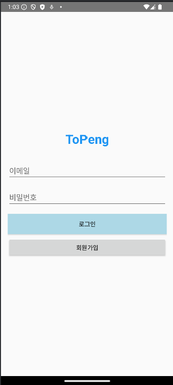
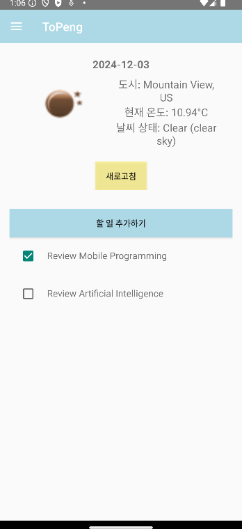
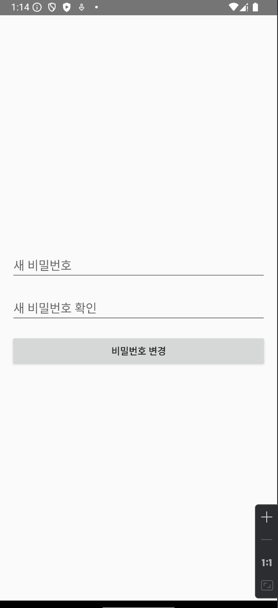

## ToPeng 🐧


## 프로젝트 소개
- 앱은 사용자가 로그인 후 **위치 기반 날씨 정보**와 **투두 리스트**를 함께 관리할 수 있는 앱입니다.
- 날씨 **API**를 통해 **실시간 날씨**를 제공하고, 투두 리스트를 통해 할 일을 쉽게 **추가하고 관리**할 수 있습니다.
- **위치 추적**을 통해 사용자의 정확한 날씨 정보를 제공합니다.

## 1. 개발 환경
- **프론트엔드**: Kotlin, Android Studio, XML
- **백엔드**: OpenWeatherMap API (날씨 정보 제공), SQLite (투두 저장), Firebase (사용자 관리 및 투두데이터 관리)

## 2. 프로젝트 구조

여기에 추가된 내용으로 프로젝트 정리본을 다시 작성해드릴게요! 개선 사항을 제외하고 나머지 부분을 반영한 내용입니다. 펭! 🐧

```text
main
│
├── java/com/example/topeng
│   ├── ui/theme
│   ├── ChangePasswordActivity.kt
│   ├── LoginActivity.kt
│   ├── MainActivity.kt
│   ├── MyPageActivity.kt
│   ├── RegisterActivity.kt
│   ├── ToDoAdapter.kt
│   ├── ToDoFragment.kt
│   ├── ToDoItem.kt
│   ├── WeatherApiService.kt
│   ├── WeatherFragment.kt
│   └── WeatherResponse.kt
│
└── res
    ├── layout
    │   ├── activity_change_password.xml
    │   ├── activity_login.xml
    │   ├── activity_main.xml
    │   ├── activity_mypage.xml
    │   ├── activity_register.xml
    │   ├── fragment_todo.xml
    │   ├── fragment_weather.xml
    │   ├── item_todo.xml
    │   └── nav_header.xml
    │
    ├── menu
    │   └── drawer_menu.xml
    │
    ├── mipmap
    │   ├── sunglass.webp
    │   └── sunglasscircle.webp
    │
    ├── values
    │   ├── colors.xml
    │   ├── strings.xml
    │   └── themes.xml
    │
    └── drawable
│
test
│
└── java/com/example/topeng
    └── ExampleUnitTest.kt

.gitignore
build.gradle.kts
proguard-rules.pro
```


## 3. 기능소개

#### **1. 회원가입 화면**
- **이메일**, **비밀번호**, **비밀번호 확인**을 입력받아 사용자가 직접 회원가입을 진행할 수 있습니다.
- **비밀번호 확인** 필드를 통해 입력한 비밀번호가 일치하는지 검증합니다.
- 

#### **2. 로그인 화면**
- **이메일**과 **비밀번호**로 사용자가 로그인을 할 수 있습니다.
- 로그인 성공 시 메인 화면으로 전환되고, **회원가입** 버튼을 통해 회원가입 화면으로 이동할 수 있습니다.
- 자동 로그인 기능을 추가하여 앱을 열 때, 사용자가 이전에 로그인한 상태라면 로그인 없이 바로 MainActivity로 이동합니다.
- 

#### **3. 메인 화면**
- **날씨 정보**와 **투두 리스트**를 한눈에 볼 수 있는 화면입니다.
- **날씨 API**를 사용해 **위치 기반 날씨**와 **날짜**를 실시간으로 가져옵니다.
- **할 일 추가** 버튼을 클릭하면 할 일이 추가되고, **길게 누르면 항목 삭제** 또는 **전체 삭제** 기능을 사용할 수 있습니다.
- 완료된 항목은 체크하면 **토스트 메시지**로 알림을 주고, 클릭 시 **수정하기** 창이 열립니다.
- **뒤로 가기 버튼**을 막아 사용자가 이전 화면으로 돌아가지 않도록 설정했습니다.
- 

#### **4. 마이 페이지**
- 사용자의 **날씨 정보**와 **할 일 목록**을 관리할 수 있는 화면입니다.
- 상단에는 **현재 날짜**, **위치**, **온도**, **날씨 상태**가 표시됩니다.
- **할 일 추가** 및 **체크박스**를 통해 할 일을 관리할 수 있습니다.
- **뒤로 가기 버튼**을 막아 사용자가 이전 화면으로 돌아갈 수 없도록 설정했습니다.
- 

#### **5. 네비게이션 드로어**
- **홈 화면**, **마이 페이지** 등 다양한 화면으로 이동할 수 있는 메뉴를 제공합니다.
- 화면 왼쪽 상단에 **메뉴 아이콘**을 클릭하면 드로어가 열리며, **회원가입**, **로그아웃**, **설정** 메뉴 등을 선택할 수 있습니다.
- 

#### **6. 비밀번호 변경 화면**
- 사용자가 **새 비밀번호**와 **새 비밀번호 확인**을 입력하여 비밀번호를 변경할 수 있습니다.
- 변경 버튼을 클릭하면 비밀번호가 **성공적으로 변경**됩니다.
- 

---

#### **7. Firebase Database 구조**

아래와 같은 방식으로 Firebase Firestore에 데이터가 저장됩니다.

- **Firestore Database 구조**
  - 사용자 **userId**에 맞는 **todos** 컬렉션에 할 일 항목들이 저장됩니다.
  - 할 일 항목은 **todoId**를 통해 관리됩니다.

  

---

#### **8.Firebase Authentication**

로그인된 사용자에 대한 정보를 **Firebase Authentication**을 사용하여 관리합니다. 각 사용자의 인증 정보는 아래에서 확인할 수 있습니다.

- **Firebase Authentication에서 사용자 관리**
  - 사용자의 **이메일**과 **UID**를 통해 **Firebase Firestore**에서 해당 사용자의 데이터를 불러옵니다.
  
  

---

### **4. 개선 목표**

#### **1. 회원가입 데이터 관리 개선**
- **데이터 저장 방식** 개선: 회원가입 시 **Firebase Authentication**을 통해 안전하게 데이터를 저장하고 관리할 예정입니다.
- **회원가입 후 자동 로그인**: 회원가입 후 바로 로그인 상태로 자동으로 이동하여 사용자 경험을 향상시킬 예정입니다.

#### **2. 날짜별 투두 리스트 정리 및 관리 최적화**
- **날짜별 투두 리스트**: 각 날짜에 해당하는 투두 리스트를 **SQLite**나 **Room Database**를 통해 저장하여 날짜별로 할 일을 효율적으로 관리합니다.
- **할 일 상태 관리**: 할 일을 추가, 삭제, 수정할 수 있는 기능을 강화하고, **완료 여부**를 쉽게 체크할 수 있도록 UI를 최적화합니다.
- **알림 기능**: 날짜별 투두 리스트에 **알림 기능**을 추가하여 사용자가 설정한 시간에 중요한 할 일을 알림으로 받을 수 있게 개선합니다.

---

### **5. 기술적 도전 과제**

#### **1. 사용자 경험 향상**
- 투두 앱에서 **사용자 경험**을 개선하는 것이 중요한 목표였습니다. 할 일을 추가하고 삭제하는 과정에서 **UI**가 직관적이지 않거나 반응 속도가 느리면 사용자 경험이 저하될 수 있었습니다.
- 특히 **할 일 추가**, **완료 처리** 기능에서 **빠르고 직관적인 피드백**을 제공하는 것이 중요했지만, 초기 구현 시 이를 처리하는 데 어려움이 있었습니다.
- **투두 목록**에서 **아이템 클릭** 시 수정 창이 뜨거나, 완료된 항목 표시 등의 상호작용을 원활하게 처리하는 데 시간이 걸렸습니다.

#### **2. 저장 과정에서의 어려움**
- **Firebase**로 데이터를 저장하고 관리하는 과정에서 **정확한 저장과 불러오기**에 어려움이 있었습니다. 
- **실시간 데이터 동기화**를 고려해야 하므로, **데이터 로딩 속도**와 **동기화 문제**를 해결하는 데 시간이 소요되었습니다.
- Firebase의 **데이터베이스 구조**를 설계할 때, 사용자별로 데이터를 분리하여 관리하는 과정에서 **효율적인 데이터 관리** 방안을 마련하는 데 시간이 들었습니다.

#### **3. 데이터 ID 설정의 어려움**
- **Firebase Firestore**에서 **고유 ID**를 생성하는 과정에서 **ID 충돌** 문제나 **ID 값 관리**에 어려움이 있었습니다.
- **자동 생성된 ID**와 **사용자별 고유 ID**를 어떻게 효율적으로 관리할지에 대한 고민이 필요했습니다. 특히 **Firestore**에서 자동 생성되는 ID와 기존 시스템의 **ID 충돌**을 방지하는 방법을 설정하는 데 시간이 걸렸습니다.
- **ID 관리**에서 오류가 발생하면 **중복된 항목**을 처리하는 데 어려움이 있었고, **정확한 ID 시스템**을 설계하는 것이 중요한 과제가 되었습니다.

---
### **느낀점**

이번 프로젝트는 **사용자 경험**과 **데이터 관리**의 중요성을 실감하게 된 경험이었습니다. 특히 **투두 앱**에서 **할 일 목록**을 저장하고 관리하는 과정에서 겪은 어려움을 통해 **데이터의 정확성**과 **앱 최적화**가 얼마나 중요한지 배웠습니다. 앞으로 더 나은 앱을 만들기 위해 **사용자 편의성**과 **효율적인 데이터 처리**에 집중해야겠다고 다짐했습니다.

---
